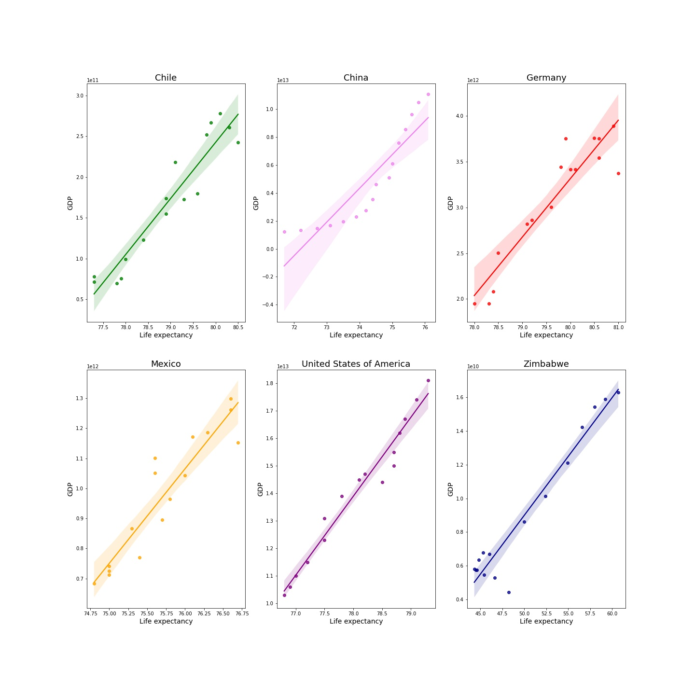

# Group-Project-Life-Expectancy-and-GDP
## Portfolio Group Project

**Investigation of data on GDP and life expectancy from the World Health Organization and the World Bank**

**Collaborators: Denis**

### Project Objectives:

- [x] Import of a dataset
- [x] Get summary statistics of a dataset
- [x] Analyze, prepare, and visualize the data in order to answer questions
- [ ] *Optional: Create a Blog Post*


### Technologies used:
```
Jupyter notebook
```

### Dataset used:
```
all_data.csv
```

### Libraries used:
```
pandas
numpy
seaborn
matplotlib
```

## How to use ##
1. Import Libraries
2. Analyze the dataset
3. Visualize the dataset

## Observations. Part 1##
1. We have life expectancy and GDP data for six nations for 2000-2015 years.
2. Mean life expectancy is 72 years.
3. Mean GDP is 3.880499e+12 US dollars.  
4. The highest life expectancy is 81.
5. The highest GDP is 1.810000e+13 US dollars.
6. The smallest life expectancy is 44.
7. The smallest GDP is 4.415703e+09 US dollars.

## Observations. Part II ##

1. Based on the plots we see one outlier for life expectancy (Zimbabwe), and the other outlier    for GDP (USA). Median life expectancy is around 77 years. Median GDP is around 200 billion US dollars.
2. GDP increased over time in all countries.
3. Life expectancy increased over time in all countries.
4. GDP and life expectancy are positively correlated.
